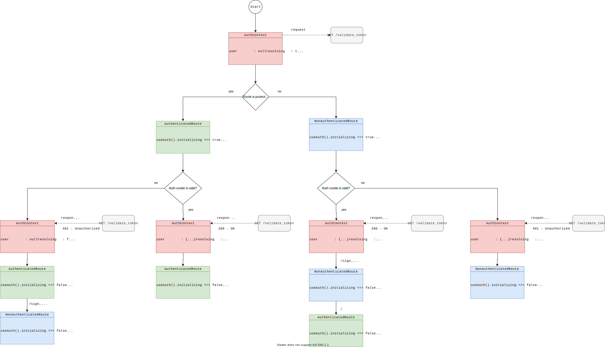
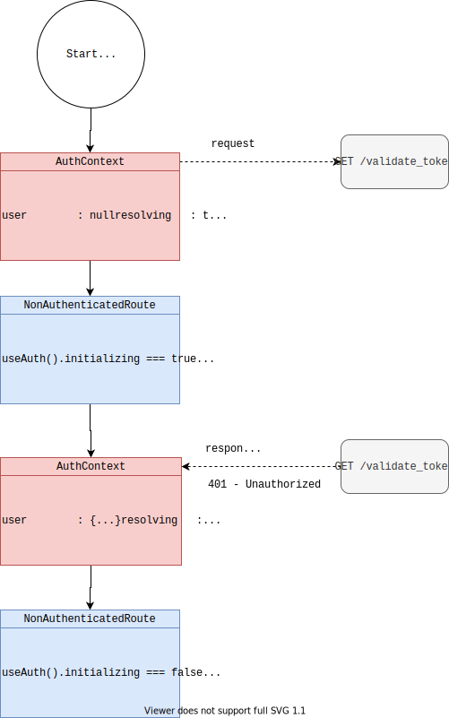
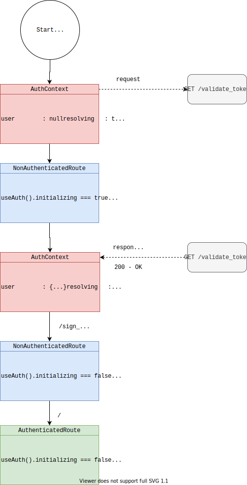
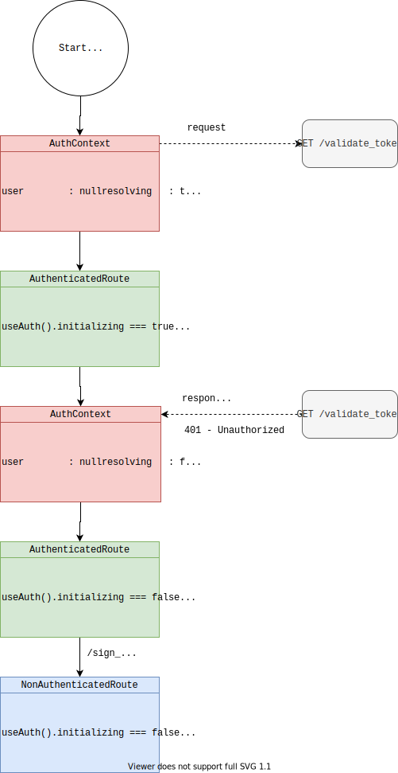
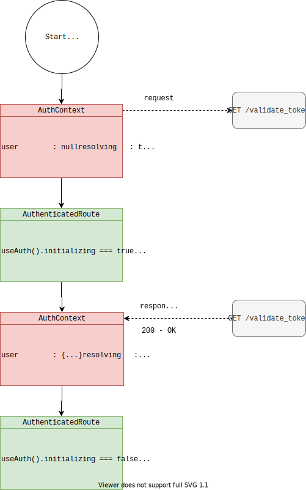
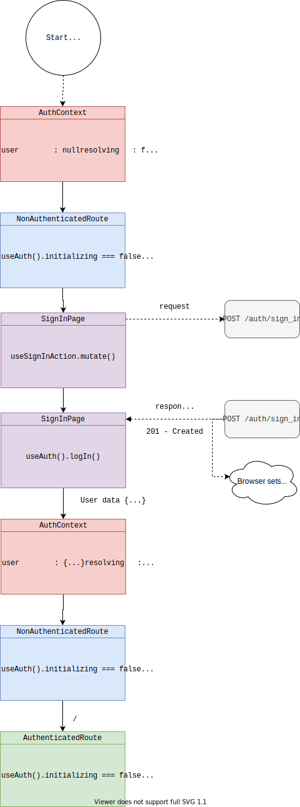
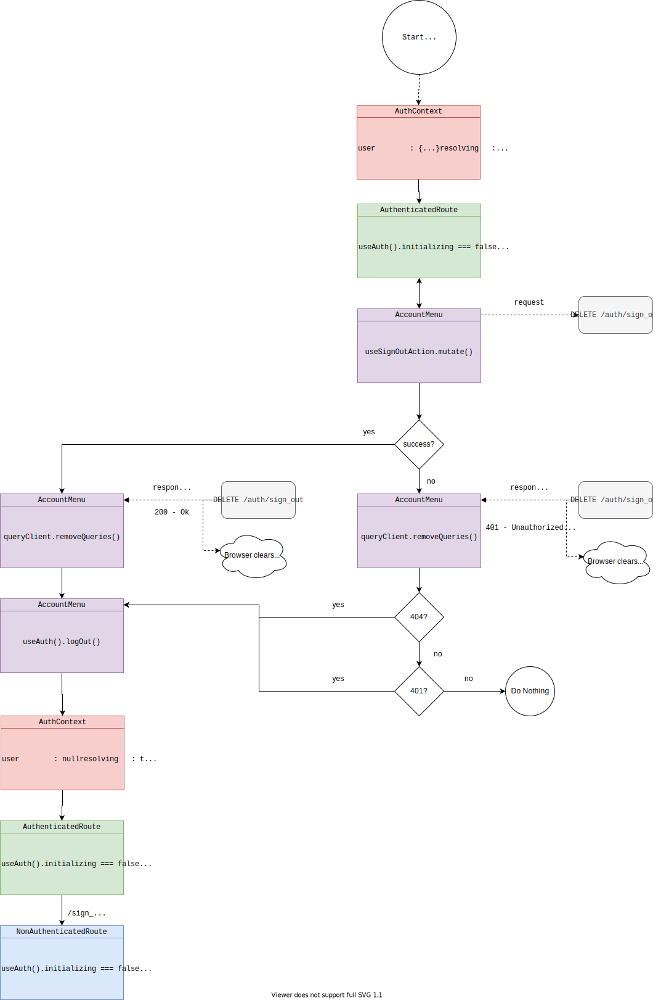

# Authentication

## Credentials Storage - Cookies

Rhino Client's authentication system is based on httponly cookies, issued by the server, and therefore not accessible via javascript. There's no need to store nor to clean access tokens, as they are stored in the auth cookie and completely handled by the browser. The server is the only responsible for issuing cookies as well as cleaning them. **If the server fails to clean the auth cookie**, the client can enter an unwanted state where it can't clean the cookie, so all requests will use an invalid cookie until it expires.

## AuthContext

Uses the [React Context API](https://reactjs.org/docs/context.html) to expose a `Provider` holding the authentication state and exposing methods like `logIn` and `logOut`, that directly alter the auth state.

`AuthProvider` issues a request for the `/validate_session`, managed by the [react-query](https://react-query.tanstack.com/) library. `react-query` refetches this request from time to time, so we can be sure that the user is always logged in. If the request fails, it means the user is not logged in, so the exposed `user` property becomes `null`. On the other hand, if the request is successful, `AuthProvider` exposes `user` as being the result of the query, meaning it holds whatever the server sends, i.e. the user information.

When a sign in occurs, the entity that issued the sign in request can just call the `logIn` from `AuthProvider` (passing user information) and signal that a sign in has successfully occurred. `logOut` is used in the same way, but for the sign out process.

When the app starts, `AuthContext` doesn't know if the user has a valid session or not, so it's neither in the `authenticated` state nor in the `unauthenticated`. For this case, the `initializing` property is exposed, being true when the first `/validate_session` request is still in progress. This property is particularly important to allow showing a splash screen or other UI hints.

Exposed properties:

- `user`: contains either the user information or `null`. If it's `null`, it means it's in the `unauthenticated` state, otherwise, it's in the `authenticated` state.
- `initializing`: when the app loads, it's neither authenticated nor unauthenticated, so it gets set to `true`. Once the validate session query is resolved for the first time, it statys `false` forever.
- `resolving`: any time the validate session query is in progress, it is set to `true`.
- `logOut`: function that sets `user` to `null`, reaching the `unauthenticated` state.
- `logIn`: function that receives an object and sets `user` to object received, reaching the `authenticated` state.
- `refreshSession`: function that forces the validate session query to be refetched.

## AuthenticatedRoute

It's a HOC that serves as a wrapper for routes that require the user to be authenticated. It is normally used once, in a high position of components tree, wrapping all routes that need authentication. It listens to `AuthContext` through `useAuth` hook and decides what to render based on the authentication state.

1. If `AuthContext` **is still resolving**, i.e. the app has just loaded and it's still figuring out if it has a valid session or not, it renders `<SplashScreen>`
2. If the user **is authenticated**, it renders its children
3. If the user **is not authenticated**, it redirects to the login page

## NonAuthenticatedRoute

It's similar to `AuthenticatedRoute`, but acts the other way around. It's normally used to wrap pre-authentication routes that can't be accessed if the user is authenticated, e.g. sign in, sign up, reset password, etc.

1. If `AuthContext` **is still resolving**, i.e. the app has just loaded and it's still figuring out if it has a valid session or not, it renders `<SplashScreen>`
2. If the user **is authenticated**, it redirects to the root page, normally `/`
3. If the user **is not authenticated**, it renders its children

## ValidateSession query

Issues a `GET /validate_session` request that returns the user information if the access token stored in the cookie is still valid or a `401 - Unauthorized` in case the user cookie is expired, invalid or absent. The behavior of constantly refetching and re-evaluating if the user is still logged in is delegated to `react-query`, so there's never a direct call to `react-query`'s `refetch` function.

Whenever the state of the validate session query changes, `AuthContext` re-renders, taking into account its state and running side effects. For example, if the query's `isFetching` is `true`, `AuthProvider`'s `resolving` will also be `true`. If the state indicates success, `user` will be set, therefore, the `authenticated` state is reached. If the state indicates failure, `user` is set to null, so the `unauthenticated` state is reached.

## SignIn action

Issues a `POST /auth/sign_in` request passing user's credentials. Upon **success**, it calls `logIn` from `AuthContext` passing the received user information, which in turn assigns this new information to `user`, reaching the `authenticated` state. Mind that the validate session query is not re-issued, as the user information is already available, cookie is automatically set and there's no doubt the user is logged in. Upon **failure**, it does nothing, as it should not change the authenticate state.

## SignOut action

Issues a `DELETE /auth/sign_out` request. Once it returns, either a success or a failure, `react-query`'s `removeQueries` is called, in order to cancel all requests and avoid problems with requests being issued without a proper cookie and leading to unexpected problems.

If it is a **success**, it simply calls `logOut` from `AuthContext`, which sets `user` to `null`, reaching the unauthenticated state. The server is responsible for issuing a cookie clean up command, so the client relies on that and on the browser actually deleting the token.

In case of a **failure**, it analyzes if the error is a `NetworkUnauthorizedError` instance, meaning that the user's session is not valid anymore. If it is, the sign out action simply calls `logOut` from `AuthContext`, which sets `user` to `null`, reaching the unauthenticated state, just like in the case of a success. A `NetworkUnauthorizedError` can happen form may reasons: token was deleted on the database, cookie expired, token expired, malformed cookie, etc. For the specific case in which the token was deleted from the database, `DeviseTokenAuth` returns a `404 - NotFound`, as it indeed wasn't possible to find the corresponding user. For this case, `networking.js` has a special treatment, which makes sure an `NetworkUnauthorizedError` is raised, so the response is treated correctly.

## Overall flow for bootstrapping the app

## Use cases

### User does not have a cookie set and navigates to the `/sign_in` page

1. When the app loads, `AuthProvider` starts
2. `AuthProvider` issues a validate token query
3. The first state emitted by `AuthProvider` has `initializing: true`
4. `SignInPage` is wrapped under a `NonAuthenticatedRoute`
5. `NonAuthenticatedRoute` checks that `AuthProvider` has `initializing === true` and renders `<SplashScreen />`
6. Validate token query returns `401 - Unauthorized`
7. `AuthProvider` sets `initializing: false` and `user: null`
8. `NonAuthenticatedRoute` checks that `AuthProvider` has `initializing === false` and `user: null`, so it renders `<SignInPage />`

### User already has a cookie set and navigates to the `/sign_in` page

1. When the app loads, `AuthProvider` starts
2. `AuthProvider` issues a validate token query
3. The first state emitted by `AuthProvider` has `initializing: true`
4. `SignInPage` is wrapped under a `NonAuthenticatedRoute`
5. `NonAuthenticatedRoute` checks that `AuthProvider` has `initializing === true` and renders `<SplashScreen />`
6. Validate token query returns `200 - Ok` with user's data
7. `AuthProvider` sets `initializing: false` and `user: {...}`
8. `NonAuthenticatedRoute` checks that `AuthProvider` has `initializing === false` and `user: {...}`, so it redirects to `routePaths.rootpath()`

### User does not have a cookie set and navigates to the `/` root page

1. When the app loads, `AuthProvider` starts
2. `AuthProvider` issues a validate token query
3. The first state emitted by `AuthProvider` has `initializing: true`
4. The root page, probably `/` returned by `routePaths.rootpath()` is wrapped under a `AuthenticatedRoute`
5. `AuthenticatedRoute` checks that `AuthProvider` has `initializing === true` and renders `<SplashScreen />`
6. Validate token query returns `401 - Unauthorized`
7. `AuthProvider` sets `initializing: false` and `user: null`
8. `AuthenticatedRoute` checks that `AuthProvider` has `initializing === false` and `user: null`, so it redirects to `/sign_in`

### User has a cookie set and navigates to the `/` root page

1. When the app loads, `AuthProvider` starts
2. `AuthProvider` issues a validate token query
3. The first state emitted by `AuthProvider` has `initializing: true`
4. The root page, probably `/` returned by `routePaths.rootpath()` is wrapped under a `AuthenticatedRoute`
5. `AuthenticatedRoute` checks that `AuthProvider` has `initializing === true` and renders `<SplashScreen />`
6. Validate token query returns `200 - Ok` with user's data
7. `AuthProvider` sets `initializing: false` and `user: {...}`
8. `AuthenticatedRoute` checks that `AuthProvider` has `initializing === false` and `user: {...}`, so it renders the page

### User is not logged in yet and issues a successful sign in request from the sign in page

1. Current state from `AuthProvider` has `user: null` and `initializing: false`
1. `NonAuthenticatedRoute` is rendering its children because `user: null` and `initializing: false`
1. User inputs valids credentials and clicks on the sign in button
1. `<SignInPage />` calls `mutate()` from the `useSignInAction` hook
1. `POST /api/auth/sign_in` is issued
1. Server responds with `201 - Created` with user's data
1. Browser sets cookie
1. `<SignInPage />` calls `logIn(userData)` from the `useAuth` hook
1. `AuthProvider` sets `user: {...}`
1. `NonAuthenticatedRoute` checks that `AuthProvider` has `initializing === false` and `user: {...}`, so it redirects to `routePaths.rootpath()`
1. User has logged in

### User is logged in with a valid cookie and issues a sign out request through the AccountMenu component

1. Current state from `AuthProvider` has `user: {...}` and `initializing: false`
1. `AuthenticatedRoute` is rendering its children because `user: {...}` and `initializing: false`
1. User clicks th sign out button from the `<AccountMenu />` component
1. `<AccountMenu />` calls `mutate()` from the `useSignOutAction` hook
1. `DELETE /api/auth/sign_out` is issued
1. If the server responds with `200 - Ok`
   1. Browser clears cookie
   1. `onSettled` callback from `react-query` is run and calls `react-query`'s `queryClient.removeQueries`, cancelling any ongoing requests so unexpected behavior because of invalid auth cookie is avoided
   1. `onSuccess` callback from `react-query` is run and calls `logOut()` from the `useAuth` hook
   1. `AuthProvider` sets `user: null`
   1. `AuthenticatedRoute` checks that `AuthProvider` has `initializing === false` and `user: null`, so it redirects to `/sign_in`
   1. User has logged out
1. If the server responds with `401 - Unauthorized`
   1. Browser clears cookie
   1. `networking.js` sees it is a 401 and throws a `NetworkUnauthorizedError`
   1. `onSettled` callback from `react-query` is run and calls `react-query`'s `queryClient.removeQueries`, cancelling any ongoing requests so unexpected behavior because of invalid auth cookie is avoided
   1. `onFailure` callback from `react-query` is run, checks that the error is a `NetworkUnauthorizedError`, and calls `logOut()` from the `useAuth` hook
   1. `AuthProvider` sets `user: null`
   1. `AuthenticatedRoute` checks that `AuthProvider` has `initializing === false` and `user: null`, so it redirects to `/sign_in`
   1. User has logged out
1. If the server responds with `404 - NotFound`
   1. Browser clears cookie
   1. `networking.js` sees it is a 404 for the sign out request and throws a `NetworkUnauthorizedError`
   1. `onSettled` callback from `react-query` is run and calls `react-query`'s `queryClient.removeQueries`, cancelling any ongoing requests so unexpected behavior because of invalid auth cookie is avoided
   1. `onFailure` callback from `react-query` is run, checks that the error is a `NetworkUnauthorizedError`, and calls `logOut()` from the `useAuth` hook
   1. `AuthProvider` sets `user: null`
   1. `AuthenticatedRoute` checks that `AuthProvider` has `initializing === false` and `user: null`, so it redirects to `/sign_in`
   1. User has logged out
1. If the server responds with another type of error
   1. Browser clears cookie
   1. `networking.js` sees it neither a 401 nor a 404 and throws other types of errors
   1. `onSettled` callback from `react-query` is run and calls `react-query`'s `queryClient.removeQueries`, cancelling any ongoing requests so unexpected behavior because of invalid auth cookie is avoided
   1. `onFailure` callback from `react-query` is run, checks that the error is **not** a `NetworkUnauthorizedError`, and **does not call** `logOut()` from the `useAuth` hook
   1. Use **has not** logged out

